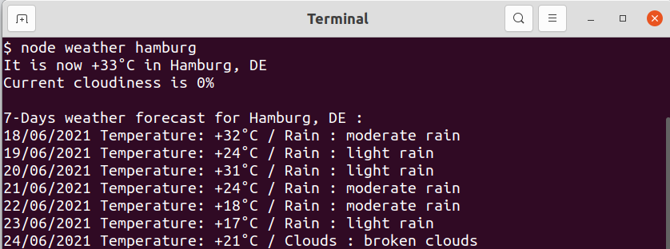

## While in the folder run in command line:

#### node weather 'any city name'
(for Celsius)

#### node weather 'any city name' imperial
(for Fahrenheit)

p.s. Use your own [OpenWeather](https://openweathermap.org/) KEY